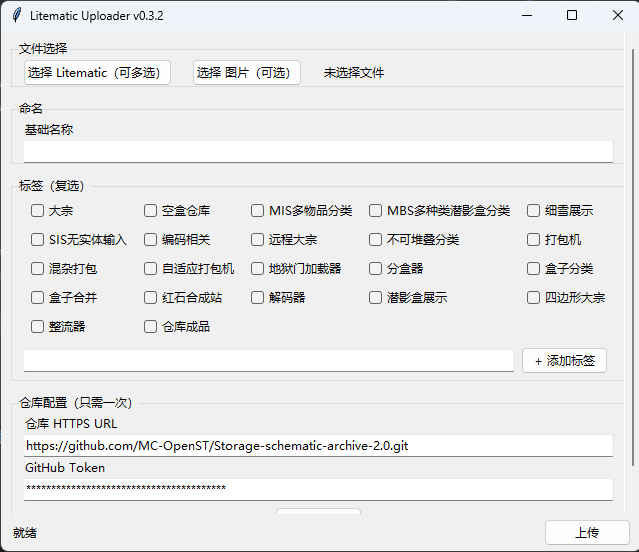
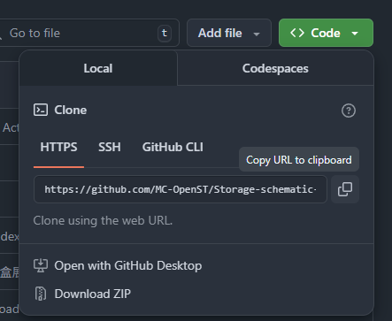

# Litematic-Uploader

一个基于python写的小工具
----------------------------

## 1. 初始设置
首先，你必须下载git才能运行此程序  
下载链接：https://git-scm.com/install/

第二步，打开cmd窗口，输入：
```bash
git config --global user.name "你的用户名"
git config --global user.email "你的邮箱"
```
**只需要执行一次，之后会是全局设定**  
*如果你之前就设置过了可以跳过这一步*
-------------------------------
## 2. 初次使用
  

 1.在仓库配置里输入仓库的HTTPS URL，仓库url可以从这里获取  



 2. 输入github token
    - token需要到你的个人设置 ➡ Developer Settings ➡ Personal access tokens ➡ Tokens (classic) 获取  
    - 点击Generate new token，选项里面选classic
    - 设置好名称之后勾选repo，不需要别的
    - 使用期限视你情况而定，默认30天有效期
    - 完成后点击Generate token。保存好，因为你一旦丢失是找不回来的
--------------------------------
## 3. 一些细节事项
- 初次使用时，可能程序会卡。这无伤大雅等待一下就行
- 确认你是仓库的所有者/仓库原组织的成员
- 有问题请提交issue，或者咨询Linvin-1233
